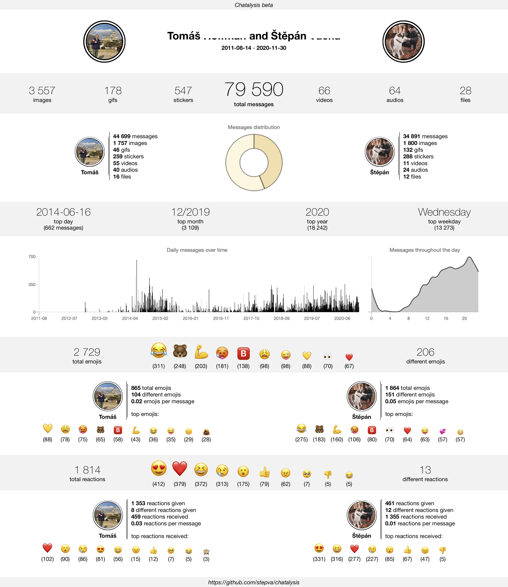

# Chatalysis

Chatalysis lets you analyse and, more importantly, visualise stats from your own Facebook Messenger chats in a nice and clean way (see below), which is easily shareable with your friends. It works for group chats, too, and includes emojis and reactions as well.

<p align="center">

</p>

## Recent Updates

- *beta*: fixing issues

## Installation

1. Download your messages from <https://www.facebook.com/dyi/>. You only need to select **Messages** and make sure to choose **JSON** as the Format and **Low** for Media Quality. It will take Facebook some time (several hours) to prepare your file and you can expect it to be a few gigabytes large.
2. Download chatalysis in a zip folder and extract it wherever you want to. 
3. Move the "messages" folder which you downloaded from Facebook into the extracted (chatalysis-master) folder.
4. Download and install [Python](https://www.python.org/downloads/) and [Node.js](https://nodejs.org/en/download/) if you do not have them.
5. In your terminal, navigate to the chatalysis folder, for example:
```
    cd ~/Desktop/chatalysis-master
```
6. Install required packages:
```
    pip install -r requirements.txt
    npm install
```
7. Now you can finally run chatalysis!
```
    python chatalysis
```
or, for example,
```
    python ~/Desktop/chatalysis-master/chatalysis
```
*(Note, that you’ll probably have to call `python3` instead of `python` on MacOS)*

## Tips

- When downloading your messages, if you want to select the Time Range, the end date is not included - i.e. if you choose 1st of December, it will only download messages up to the end of 30th of November.
- If you want to add profile pictures to the infographic, download them and save them as "namesurname" (for example stepanvacha.jpg) into the /resources/images folder.
- To download and analyse new messages after you have already downloaded your messages from Facebook in the past, you don't have to download all your messages again. Just choose the *Time Range* to be from the date you downloaded it last time and once you download the folder, rename the "messages" folder to, for example, "messages2" or "messages-2" etc. (Just leave the "messages" in there). Now just move it to the chatalysis-master folder next to your current messages folder and you can chatalyse!
- You can find all created HTML files with your infographics for each chat in the /output folder. If you want to share them with anyone, I recommend saving them as .pdf, which can be done easily in any browser.

