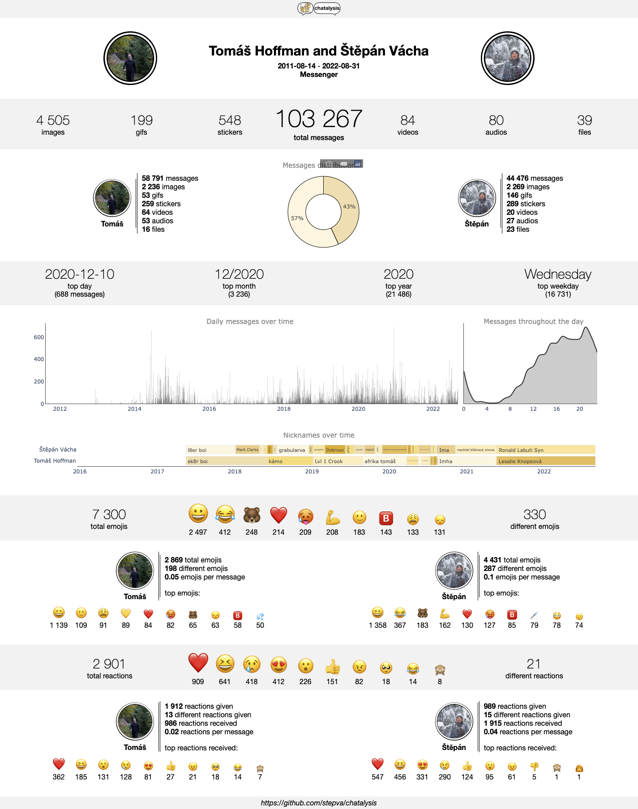
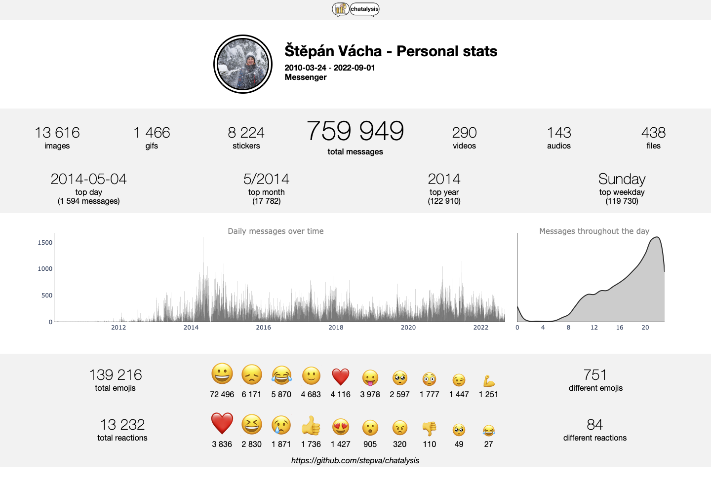

# Chatalysis 📈💬

Chatalysis lets you analyse and, more importantly, visualise stats from your own **Facebook Messenger** and **Instagram** chats in a nice and clean way (see below), which is easily shareable with your friends. It works for group chats, too, and includes emojis and reactions as well. All on your computer, without giving your messages and data to any third-party apps. Not even to us.

<p align="center">

</p>

There is also an option to generate your own Personal stats - overview of anything related to all messages sent only by you, across all conversations.

<p align="center">

</p>

## Installation

1. Download your messages from [Facebook](https://www.facebook.com/dyi/) or [Instagram](https://www.instagram.com/download/request/). Make sure to choose **JSON** as the output format. For Messenger, you only need to download **Messages** with **Low** media quality (you can select higher media quality, but it will make the files larger and it is not necessary for Chatalysis). It will take Facebook some time (several hours) to prepare your file and you can expect it to be a few gigabytes large. You will get a notification or an email when it's ready to download.
2. [Download chatalysis in a zip folder](https://github.com/stepva/chatalysis/archive/refs/tags/v1.1.4.zip) and extract it wherever you want to.
3. Extract the downloaded data into any folder you like. It is possible that Facebook splits your data into multiple files. Download all of them and extract them into one folder. When selecting a folder in Chatalysis, select the parent folder into which you extracted all the data. However, make sure to save the Messenger data and Instagram data to different places! Don't get them mixed up in one parent folder.
4. Download and install [Python 3.10+](https://www.python.org/downloads/) (remember to add it to PATH when installing it) if you don't have it. On Linux you might also need to install tkinter for Python, which can be done via `sudo apt-get install python-tk`.
5. In your terminal, navigate to the chatalysis folder, for example:

```
    cd Desktop/chatalysis-1.1.4
```

6. Install required packages:

```
    pip install -r requirements.txt
```

7. Now you can finally run chatalysis!

```
    python chatalysis
```

or, for example,

```
    python Desktop/chatalysis-1.1.4/chatalysis
```

_(You’ll probably have to call `python3` instead of `python` on MacOS)_

## Tips and notes

- When downloading your messages from Facebook, if you want to select the _Time Range_, the end date is not included - i.e. if you choose 1st of December, it will only download messages up to the end of 30th of November.
- If you want to add profile pictures to the infographic, download them and save them as "namesurname" (for example stepanvacha.jpg) into the /resources/images folder.
- To download and analyse new messages after you have already downloaded your messages in the past, you don't have to download all of them again. Just choose the _Time Range_ to be from the date you downloaded it last time and once you download the folder, move it to the same place where you have previously saved your other messages folder(s) and you can chatalyse!
- You can find all created HTML files with your infographics for each chat in the /output folder. If you want to share them with anyone, I recommend saving them as .pdf, which can be done easily in any browser.
- We value any feedback! In the rare occassion that you encounter a bug (?!) or if have any ideas for the future development and improvement of Chatalysis, let us know! Open an issue, find us on any social media, our DMs are always open :)
