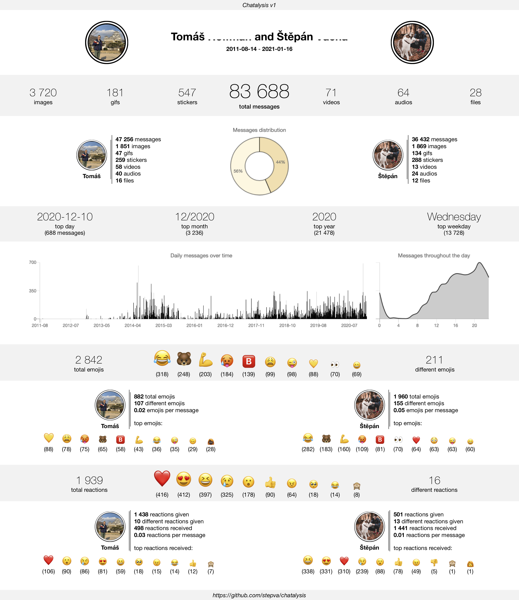

# Chatalysis

Chatalysis lets you analyse and, more importantly, visualise stats from your own Facebook Messenger and Instagram chats in a nice and clean way (see below), which is easily shareable with your friends. It works for group chats, too, and includes emojis and reactions as well. All on your computer, without giving your messages and data to any third-party apps. Not even to me.

<p align="center">

</p>

Recently, we have also added the option to generate your own Personal stats - overview of anything related to all messages sent only by you, in all chats.

<p align="center">

</p>

## Installation

1. Download your messages from [Facebook](https://www.facebook.com/dyi/) or from [Instagram](https://www.instagram.com/download/request/). Make sure to choose **JSON** as the output format. For Messenger, you only need to download **Messages** with **Low** media quality (you can select higher media quality, but it will make the files larger and it is not necessary for Chatalysis). It will take Facebook some time (several hours) to prepare your file and you can expect it to be a few gigabytes large. You will get a notification when it's ready to download.
2. [Download chatalysis in a zip folder](https://github.com/stepva/chatalysis/archive/refs/tags/v1.0.10.zip) and extract it wherever you want to.
3. Extract the downloaded data into any folder you like. It is possible that Facebook splits your data into multiple files. Download all of them then, one of them will probably be called "messages" while you might have to get the "messages" folder out of the other files you downloaded. Move all the "messages" folders into one folder, naming them "messages-2", "messages-3" etc. for example.
4. Download and install [Python](https://www.python.org/downloads/) (remember to add it to PATH when installing it) if you don't have it. On Linux you might also need to install tkinter for Python, which can be done via `sudo apt-get install python-tk`.
5. In your terminal, navigate to the chatalysis folder, for example:

```
    cd Desktop/chatalysis-1.0.10
```

6. Install required packages:

```
    pip install -r requirements.txt
```

7. Now you can finally run chatalysis!

```
    python chatalysis
```

or, for example,

```
    python Desktop/chatalysis-1.0.10/chatalysis
```

_(You’ll probably have to call `python3` instead of `python` on MacOS)_

## Tips

- When downloading your messages, if you want to select the Time Range, the end date is not included - i.e. if you choose 1st of December, it will only download messages up to the end of 30th of November.
- If you want to add profile pictures to the infographic, download them and save them as "namesurname" (for example stepanvacha.jpg) into the /resources/images folder.
- To download and analyse new messages after you have already downloaded your messages from Facebook in the past, you don't have to download all your messages again. Just choose the _Time Range_ to be from the date you downloaded it last time and once you download the folder, rename the "messages" folder to, for example, "messages2" or "messages-2" etc. (Just leave the "messages" in there). Now just move it to the chatalysis-1.0.10 folder next to your current messages folder and you can chatalyse!
- You can find all created HTML files with your infographics for each chat in the /output folder. If you want to share them with anyone, I recommend saving them as .pdf, which can be done easily in any browser.
